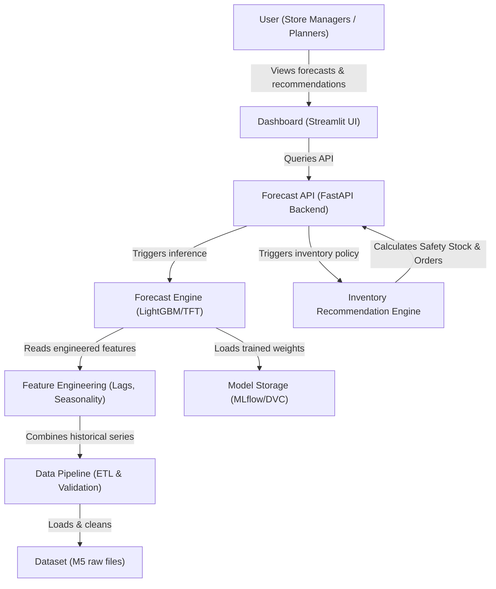

# FreshMind – Predictive Supply Chain: FMCG Demand Forecasting & Replenishment

An AI-powered, production-grade demand forecasting and inventory replenishment system designed to replace legacy heuristics with state-of-the-art machine learning models, optimizing supply chain margins for FMCG retail.

---

## Business Scenario & Problem Statement

**Business Context:**
FreshKart is a fictional 500-store FMCG retail chain. The current replenishment strategy relies on a simple **90-day Moving Average**, which is unresponsive to seasonality, promotional schedules, weather patterns, and holidays.

**Business Challenges:**
*   **Stockouts:** Cause **₹4 Crore/month** in lost sales due to empty shelves during high-demand events.
*   **Overstocking:** Results in an **8% wastage rate** of perishable goods due to expiration.
*   **Forecast Inaccuracy:** Legacy methods fail to capture complex seasonal spikes, promotion overlaps (such as SNAP benefits), and localized trends.

**Project Objective:**
Develop a scalable machine learning and decision-science pipeline to:
1.  Predict daily demand for every store-SKU combination.
2.  Determine optimal replenishment order quantities that minimize the combined costs of stockouts (lost sales) and inventory holding.

---

## Technical Stack & Rationale

| Component | Technology | Rationale |
| :--- | :--- | :--- |
| **Language** | Python 3.12+ | Industry standard for data pipelines, machine learning, and numerical execution. |
| **Data Manipulation** | Pandas & NumPy | High-performance tabular data structures and vectorized operations. |
| **Statistical Modeling** | Prophet, Scikit-learn | Fast baseline time-series models and preprocessing utilities. |
| **Machine Learning** | LightGBM | Highly efficient gradient boosting for large-scale, high-dimensional tabular forecasts. |
| **Deep Learning** | PyTorch (TFT, N-BEATS) | Deep learning framework to implement Temporal Fusion Transformers (TFT) and N-BEATS. |
| **Data Validation** | Pydantic | Enforces strict schema validations and type constraints at execution runtime. |
| **Testing** | Pytest | Scalable unit-testing framework for verifying data ingestion and loader components. |
| **Containerization** | Docker | Packages application dependencies and code into a single, deployable image. |
| **Version Control** | Git & GitHub | Code versioning, collaboration, and structured merge workflows. |
| **MLOps & Tracking** | MLflow & DVC | Tracks model experiments, hyperparameter logs, and stores dataset versions. |
| **User Interface** | Streamlit | Rapid prototyping of clean, interactive business dashboards. |
| **Development** | VS Code & Jupyter | Professional IDE and interactive notebooks for exploratory data analysis (EDA). |

---

## System Architecture

The following block outlines the system boundaries and component linkages:



*For detailed component descriptions, see [docs/architecture.md](file:///c:/Users/Saurav/Desktop/Predictive%20Supply%20Chain/docs/architecture.md).*

---

## Folder Structure

```text
FreshMind/
│
├── data/
│   ├── raw/                # Original, immutable data files (calendar, prices, sales)
│   ├── processed/          # Cleaned, structured, and feature-engineered datasets
│   └── archive/            # Legacy or inactive dataset files
│
├── notebooks/              # Jupyter notebooks for EDA and rapid prototyping
│
├── src/                    # Core modular production source code
│   ├── __init__.py
│   ├── data/               # Ingestion, schema validation, and loading modules
│   ├── features/           # Feature engineering logic (future step)
│   ├── models/             # Forecasting model training and inference (future step)
│   ├── inventory/          # Safety stock and order recommendation logic (future step)
│   └── utils/              # Logging, configuration loader, and helper utilities
│
├── configs/                # Externalized YAML configuration parameters
│
├── docs/                   # System design, architecture diagrams, and docs
│
├── reports/                # Generated data summaries, performance metrics, plots
│
├── dashboard/              # Streamlit frontend files
│
├── models/                 # Saved model binaries, weights, and parameters
│
├── tests/                  # Pytest unit tests for pipeline components
│
├── scripts/                # Utility shell and python scripts (e.g. data download)
│
├── assets/                 # Static images, UI screenshots, and diagrams
│
├── requirements.txt        # Production dependency pins
│
├── .gitignore              # Standard git exclusion rules
│
└── README.md               # Master documentation (this file)
```

---

## Ingesting the M5 Dataset

The M5 Forecasting dataset consists of the following key files:
1.  `calendar.csv`: Holiday markers, weekday mappings, and SNAP promotional benefit schedules.
2.  `sell_prices.csv`: Weekly pricing logs per store-item combination.
3.  `sales_train_validation.csv`: Daily historical unit sales for 3,049 items across 10 stores.
4.  `sample_submission.csv`: File schema representing the prediction targets.

### Installation & Execution Guide

1.  **Clone the Repository:**
    ```bash
    git clone https://github.com/Sauravsinghhh/Predictive-Supply-Chain-FMCG-demand-forecasting-.git
    cd Predictive-Supply-Chain-FMCG-demand-forecasting-
    ```

2.  **Create and Activate Virtual Environment:**
    ```bash
    python -m venv .venv
    # Windows:
    .venv\Scripts\activate
    # macOS/Linux:
    source .venv/bin/activate
    ```

3.  **Install Dependencies:**
    ```bash
    pip install --upgrade pip
    pip install -r requirements.txt
    ```

4.  **Acquire Dataset (Choose Mode):**
    *   **Developer Sandbox (Recommended for quick test):** Generates fully schema-compliant, lightweight synthetic files so the pipeline runs instantly without a 300MB download.
        ```bash
        python scripts/download_data.py --sample
        ```
    *   **Production/Full Dataset:** Downloads the full zip file, decompresses M5 CSVs, and places them into the correct directory.
        ```bash
        python scripts/download_data.py
        ```

5.  **Run Ingestion & Validation Pipeline:**
    ```bash
    python src/data/data_loader.py
    ```

6.  **Run Unit Test Suite:**
    ```bash
    pytest tests/
    ```

---

## Future Project Roadmap

*   **Week 1 (Current):** Project skeleton, configuration, dataset downloader, validation scripts, C4 architecture, and unit testing.
*   **Week 2:** Exploratory Data Analysis (EDA) and Baseline Forecasting Models (Naive, SNaive, ETS).
*   **Week 3:** Machine Learning Models (LightGBM, Prophet) and comprehensive Feature Engineering.
*   **Week 4:** Deep Learning Models (TFT, N-BEATS, PatchTST) on PyTorch.
*   **Week 5:** Hierarchical Forecasting, Bottom-Up reconciliation, and MinT optimization.
*   **Week 6:** Inventory Optimization (Safety stock calculation, Order-Up-To execution) and Streamlit dashboard.

---

## Project Metadata

*   **Author:** Saurav Singh
*   **Segment:** Supply Chain ML & Operations Research
*   **Target Roles:** Machine Learning Engineer, MLOps Engineer, Data Engineer
*   **License:** MIT License
