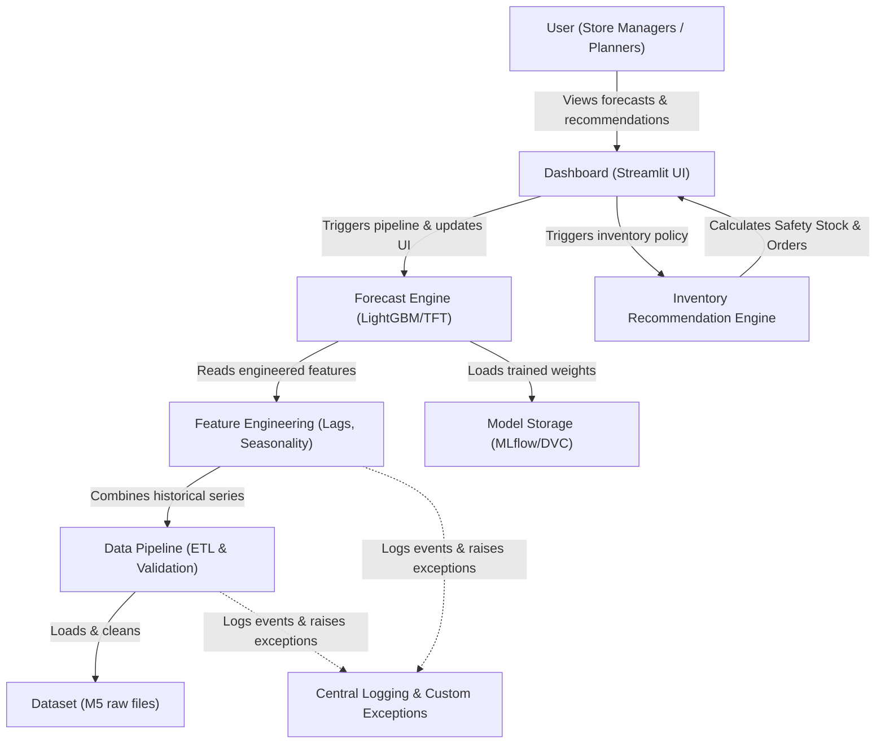

# FreshMind – Predictive Supply Chain: FMCG Demand Forecasting & Replenishment

An AI-powered, production-grade demand forecasting and inventory replenishment system designed to replace legacy heuristics with state-of-the-art machine learning models, optimizing supply chain margins for FMCG retail.

---

## 🏬 Business Scenario & Problem Statement

**Business Context:**
FreshKart is a fictional 500-store FMCG retail chain. The current replenishment strategy relies on a simple **90-day Moving Average**, which is unresponsive to seasonality, promotional schedules, weather patterns, and holidays.

**Business Challenges:**
*   **Stockouts:** Cause **₹4 Crore/month** in lost sales due to empty shelves during high-demand events.
*   **Overstocking:** Results in an **8% wastage rate** of perishable goods due to expiration.
*   **Forecast Inaccuracy:** Legacy methods fail to capture complex seasonal spikes, promotion overlaps (such as SNAP benefits), and localized trends.

**Project Objective:**
Develop a scalable machine learning and decision-science pipeline to:
1.  Predict daily demand for every store-SKU combination.
2.  Determine optimal replenishment order quantities that minimize the combined costs of stockouts (lost sales) and inventory holding.

---

## 🛠️ Technical Stack & Rationale

| Component | Technology | Rationale |
| :--- | :--- | :--- |
| **Language** | Python 3.12+ | Industry standard for data pipelines, machine learning, and numerical execution. |
| **Data Manipulation** | Pandas & NumPy | High-performance tabular data structures and vectorized operations. |
| **Statistical Modeling** | Prophet, Scikit-learn | Fast baseline time-series models and preprocessing utilities. |
| **Machine Learning** | LightGBM | Highly efficient gradient boosting for large-scale, high-dimensional tabular forecasts. |
| **Deep Learning** | PyTorch (TFT, N-BEATS) | Deep learning framework to implement Temporal Fusion Transformers (TFT) and N-BEATS. |
| **Data Validation** | Pydantic | Enforces strict schema validations and type constraints at execution runtime. |
| **Testing** | Pytest | Scalable unit-testing framework for verifying data ingestion and loader components. |
| **Containerization** | Docker | Packages application dependencies and code into a single, deployable image. |
| **CI/CD** | GitHub Actions | Automatically installs dependencies, runs tests, and validates builds on push/PR. |
| **Logging & Auditing** | Python Logging | Centralized configuration for persistent file logging and container stdout logs. |
| **User Interface** | Streamlit | Rapid prototyping of clean, interactive business dashboards. |

---

## 🏗️ System Architecture

The following block outlines the system boundaries and component linkages:



*For detailed architectural explanations, see [docs/architecture.md](file:///c:/Users/Saurav/Desktop/Predictive%20Supply%20Chain/docs/architecture.md).*

---

## 📂 Folder Structure

```text
FreshMind/
│
├── .github/
│   └── workflows/          # GitHub Actions Continuous Integration pipeline scripts
│       └── ci.yml
│
├── data/
│   ├── raw/                # Original, immutable data files (calendar, prices, sales)
│   ├── processed/          # Cleaned, structured, and feature-engineered datasets
│   └── archive/            # Legacy or inactive dataset files
│
├── notebooks/              # Jupyter notebooks for EDA and rapid prototyping
│
├── src/                    # Core modular production source code
│   ├── __init__.py
│   ├── data/               # Ingestion, schema validation, and loading modules
│   ├── features/           # Feature engineering logic (lags, rolling stats)
│   ├── models/             # Forecasting model training and inference
│   ├── inventory/          # Safety stock and order recommendation logic
│   └── utils/              # Custom exceptions, logging configurations, and helpers
│
├── configs/                # Central YAML settings and logging configurations
│   ├── config.yaml
│   └── logging_config.py
│
├── docs/                   # System design, Architecture Decision Records (ADRs), and demo scripts
│   ├── adr/
│   │   ├── ADR-001-baseline-and-streamlit.md
│   │   ├── ADR-002-testing-strategy.md
│   │   └── ADR-003-logging-and-error-handling.md
│   ├── demo_script_week_2.md
│   └── demo_script_week_3.md
│
├── reports/                # Generated data summaries, performance metrics, and technical articles
│   ├── data_status_report.md
│   ├── technical_blog_01.md
│   └── status_report_week_3.md
│
├── dashboard/              # Streamlit frontend files (app.py)
│
├── models/                 # Saved model binaries, weights, and parameters
│
├── tests/                  # Pytest unit and integration test suite files
│
├── scripts/                # Utility execution scripts (e.g. data downloader/generator)
│
├── requirements.txt        # Production dependency pins
│
├── .gitignore              # Git exclusion rules
│
└── README.md               # Master documentation (this file)
```

---

## 🚀 15-Minute Setup & Quick-Start Guide

Get the project running locally and see output in under 15 minutes by following these steps.

### 1. Prerequisites
Ensure you have the following installed on your machine:
*   Python 3.12 or higher
*   Git

### 2. Clone the Repository
Open your terminal and run:
```bash
git clone https://github.com/Sauravsinghhh/Predictive-Supply-Chain-FMCG-demand-forecasting-.git
cd Predictive-Supply-Chain-FMCG-demand-forecasting-
```

### 3. Create a Virtual Environment & Install Dependencies
Create and activate an isolated environment, then install requirements:
```bash
# Create virtual environment
python -m venv .venv

# Activate virtual environment
# On Windows (Command Prompt):
.venv\Scripts\activate.bat
# On Windows (PowerShell):
.venv\Scripts\activate.ps1
# On macOS/Linux:
source .venv/bin/activate

# Install dependencies
python -m pip install --upgrade pip
pip install -r requirements.txt
```

### 4. Set Up the Test Sandbox Dataset (2 Seconds)
To run the project locally or run tests immediately without downloading the full 300MB dataset, generate a schema-compliant, lightweight synthetic sandbox dataset:
```bash
python scripts/download_data.py --sample
```
*(To download the full, actual M5 Forecasting dataset, omit the `--sample` flag: `python scripts/download_data.py`)*

### 5. Run Ingestion & Data Validation
Execute the ingestion script to clean the data, apply memory downcasting optimizations, validate schemas, and generate an ingestion report:
```bash
python src/data/data_loader.py
```
*Review the validation report generated at [reports/data_status_report.md](file:///c:/Users/Saurav/Desktop/Predictive%20Supply%20Chain/reports/data_status_report.md) and logs recorded in `logs/app.log`.*

### 6. Run the Test Suite
Run all unit and integration tests using pytest:
```bash
python -m pytest
```

### 7. Run the Streamlit Dashboard UI
Launch the interactive web application:
```bash
streamlit run dashboard/app.py
```
Your browser will automatically open to `http://localhost:8501`. Here you can select stores/SKUs, select forecasting horizons, adjust inventory buffers, view replenishment orders, and inspect interactive charts!

---

## 🛡️ Software Hardening & Quality Control

FreshMind is built with professional engineering standards:
*   **Centralized Logging:** Centralized logging in `configs/logging_config.py` captures events, optimization metrics, and execution steps, writing simultaneously to standard output and `logs/app.log`.
*   **Custom Exceptions:** Specific exception definitions in `src/utils/errors.py` (e.g. `MissingDatasetError`, `InvalidSKUError`) eliminate silent failures and allow callers to gracefully intercept and present error dialogs.
*   **Test Coverage:** Pytest suite covers memory downcasting, feature transformations, baseline forecasting models, utility classes, and end-to-end integration flows.
*   **GitHub Actions CI:** Every pull request and push to the main branch triggers automated linting, environment builds, and test runs to guarantee main remains stable and deployable.

---

## 🔍 Troubleshooting

*   **Error:** `MissingDatasetError` or `Required file ... not found`
    *   *Solution:* Run the sample generator script to populate data files: `python scripts/download_data.py --sample`
*   **Error:** `InvalidSKUError` or `SKU ID ... not found`
    *   *Solution:* Make sure the SKU you select in the dashboard or features module exists in the sales dataset. On synthetic data, items are named `HOBBIES_1_001` through `HOBBIES_1_050`.
*   **Error:** `pytest` command not recognized.
    *   *Solution:* Ensure you have activated your virtual environment (`.venv\Scripts\activate`) where dependencies were installed, or execute using `python -m pytest`.

---

## 🗺️ Project Roadmap

*   **Week 1:** Project skeleton, data loader, validations, C4 architecture, and basic unit testing.
*   **Week 2:** Skinny MVP Pipeline, simple features, baseline forecasts, replenishment formulas, and Streamlit dashboard.
*   **Week 3 (Current):** Project hardening, specific error handling, centralized logging configurations, new feature/utility unit tests, pipeline integration test, and GitHub Actions CI.
*   **Week 4:** Feature engineering expansion (seasonality, holiday indicators, SNAP benefits, prices) and first Machine Learning model (LightGBM).
*   **Week 5:** Deep Learning Forecasting Models (Temporal Fusion Transformers, N-BEATS) using PyTorch.
*   **Week 6:** Hierarchical reconciliation (bottom-up and MinT), safety stock inventory policy expansion, and dashboard finalization.
