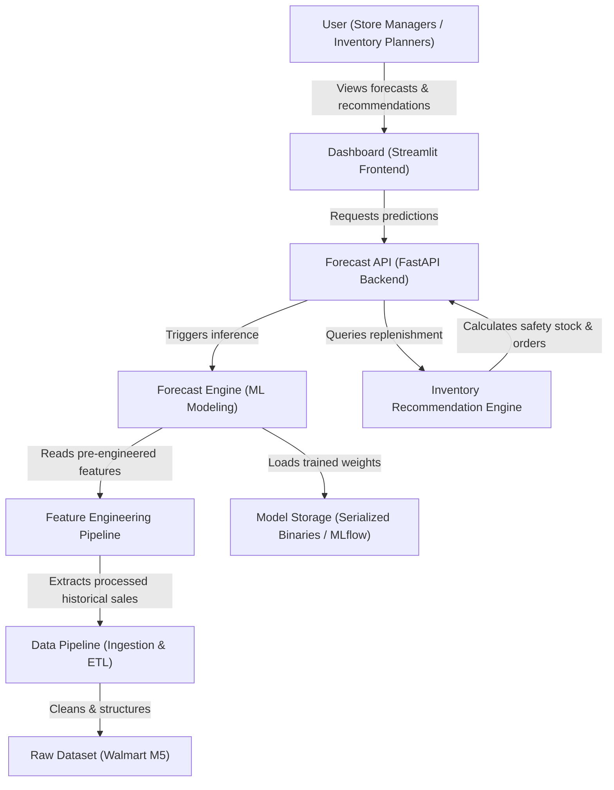

# System Architecture - FreshMind

This document details the System Architecture (C4 Level 1 Context Diagram equivalent) for the **FreshMind: FMCG Predictive Supply Chain Demand Forecasting & Replenishment** system.

## C4 Level 1 Context Diagram

---

## Component Details

### 1. User
*   **Role:** Store managers, inventory controllers, and supply chain analysts.
*   **Action:** Interacts with the Dashboard to inspect daily demand forecasts, examine stockout risk heatmaps, and download recommended replenishment purchase orders.

### 2. Dashboard
*   **Technology:** Streamlit / Python.
*   **Function:** Responsive web application displaying:
    *   Forecast vs. Actual sales plots.
    *   Stockout Risk Heatmaps (highlighting high-probability shelf-empty events).
    *   Replenishment schedules with suggested order quantities.

### 3. Forecast API
*   **Technology:** FastAPI / REST interface.
*   **Function:** Serves predictions and recommendations to downstream systems. Acts as the orchestrator between the user frontend, the modeling engine, and the inventory logic.

### 4. Forecast Engine
*   **Technology:** LightGBM, Prophet, PyTorch (TFT, N-BEATS).
*   **Function:** Generates multi-horizon point and probabilistic demand predictions at the Store-SKU-Day level.

### 5. Feature Engineering
*   **Technology:** Pandas / NumPy / Scikit-learn.
*   **Function:** Computes lags, rolling window statistics, Fourier features for seasonality, and merges calendar metadata (holidays, SNAP promotions, events).

### 6. Data Pipeline
*   **Technology:** Pandas / PySpark (local execution).
*   **Function:** Validates schemas, enforces data constraints (non-negative sales, matching calendar dates), resolves duplicates, and handles missing price/promotion records.

### 7. Dataset (Walmart M5 Raw)
*   **Description:** Contains historical weekly sales, prices, calendar promotions (SNAP benefits), and event schedules across 10 stores and 3 states (CA, TX, WI) for 3,049 items.

### 8. Model Storage
*   **Technology:** Local filesystem (with DVC tracking) or MLflow Model Registry.
*   **Function:** Version-controls trained models, parameters, and structural weights, ensuring reproducible deployments.

### 9. Inventory Recommendation Engine
*   **Technology:** SciPy / Python custom logic.
*   **Function:** Applies an **Order-Up-To (s, S) Policy** and calculates **Safety Stock** based on demand distribution (probabilistic forecasts), target service level (e.g. 95%), and lead times.
