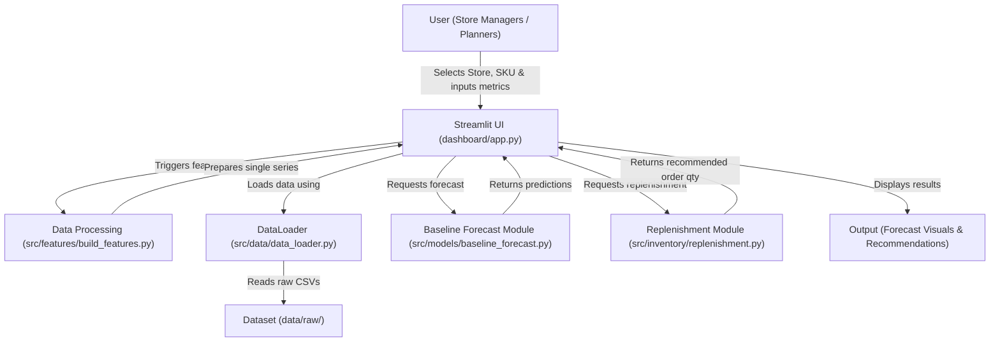

# System Architecture - FreshMind (Week 2 Actual)

This document details the actual system architecture implemented for the **FreshMind: FMCG Predictive Supply Chain Demand Forecasting & Replenishment** system as of Week 2.

## Implemented Architecture Diagram

---

## Component Details

### 1. User
* **Role:** Store managers, inventory planners, and supply chain analysts.
* **Function:** Selects store/SKU filter options, chooses forecasting model, and adjusts inventory decision metrics (current inventory and safety buffer) in the Streamlit UI.

### 2. Streamlit UI (`dashboard/app.py`)
* **Technology:** Streamlit.
* **Function:** Coordinates execution flow, renders user input widgets, pulls data via the DataLoader, calls features preparation, triggers forecast/replenishment runs, and handles output rendering.

### 3. Data Processing (`src/features/build_features.py`)
* **Technology:** Pandas / NumPy.
* **Function:** Prepares time-series data for a single store-SKU combination by melting wide sales records into a long format, merging calendar metadata (dates, weekdays, months), and calculating rolling indicators (rolling mean and standard deviation).

### 4. DataLoader (`src/data/data_loader.py`)
* **Technology:** Pandas.
* **Function:** Configured by `configs/config.yaml`, handles ingestion loading and downcasting logic for M5 calendar, prices, and sales validation. Extended to expose clean DataFrame loading.

### 5. Dataset (`data/raw/`)
* **Description:** Schema-compliant CSV tables (calendar, sell_prices, sales_train_validation) representing walmart sales history, calendar dates, and item pricing.

### 6. Baseline Forecast Module (`src/models/baseline_forecast.py`)
* **Technology:** NumPy / Object-Oriented python forecasters.
* **Function:** Fits historical target sales arrays and outputs point predictions for a given horizon. Supports:
  * **Naive Forecast:** Propagates last historical value.
  * **Seasonal Naive:** Propagates weekly seasonality (7-day lag).
  * **Simple Moving Average:** Evaluates and propagates the mean of a rolling window.

### 7. Replenishment Module (`src/inventory/replenishment.py`)
* **Technology:** Basic inventory algebra.
* **Function:** Computes recommended immediate order sizes using the formula:
  $$\text{Recommended Order} = \max(0, \text{Forecast Demand} - \text{Current Inventory} + \text{Safety Buffer})$$

### 8. Output
* **Function:** Displays the visual results to the User. Includes interactive Plotly lines charting historical trends alongside predictions, metric cards summarizing replenishment orders, and reactive under-stock warning banners.
